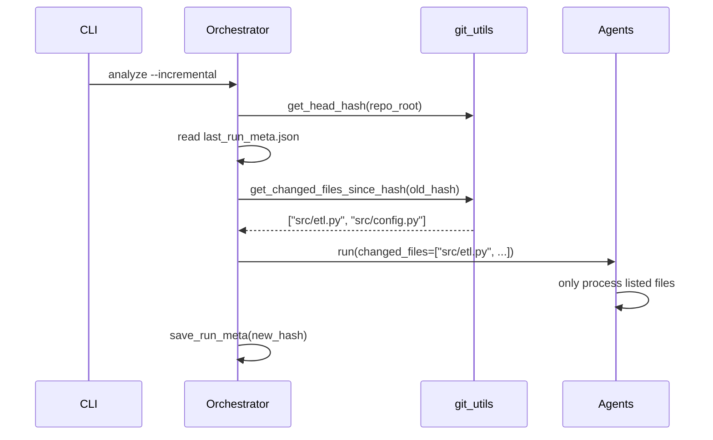

# Report 2: Architecture Diagram and Pipeline Design Rationale

> **Subject**: Brownfield Cartographer — Internal Architecture and Design Decisions
> **Analysis Date**: 14 March 2026
> **Target Repo Analyzed**: Apache Airflow `example_dags`

---

## 1. Executive Summary

The Brownfield Cartographer is a **multi-agent codebase intelligence system** designed to answer the five questions every FDE needs in their first 72 hours in a production environment. This report documents the complete pipeline architecture, each agent's role and design rationale, the data models used, and the flow of information from a raw Python file on disk through to an interactive, query-able knowledge graph.

---

## 2. Full System Architecture Diagram

The following Mermaid diagram represents the complete end-to-end pipeline as implemented in this project:

```mermaid
flowchart TD
    %% ============================================================
    %% INPUT LAYER
    %% ============================================================
    subgraph INPUT["📂 Input Layer"]
        REPO["fa:fa-folder Target Repository\n(local path or GitHub URL)\ne.g., example_dags/"]
        GIT["fa:fa-code-branch Git History\n(.git/logs)\n→ commit velocity"]
        ENV["fa:fa-cog .env Config\nLLM provider, model,\nOllama base_url"]
    end

    %% ============================================================
    %% ORCHESTRATOR
    %% ============================================================
    subgraph ORCH["🎛️ Orchestrator (orchestrator.py)"]
        INC["Incremental Mode Check\n→ git diff since last HEAD hash\n→ filters changed_files list"]
        CLONE["GitHub URL Clone\n→ git clone to /tmp/\n→ resolves repo_root"]
    end

    %% ============================================================
    %% AGENT 1: SURVEYOR
    %% ============================================================
    subgraph SURVEY["🔭 Agent 1: Surveyor (surveyor.py)"]
        direction TB
        WALK["iter_repo_files()\n→ walks .py, .sql, .yaml, .ipynb"]
        LANG["detect_language()\n→ Language enum: PYTHON, SQL, YAML, NOTEBOOK"]
        AST_PY["Python AST Parser\n→ tree-sitter grammar\n→ extracts: imports, functions,\n  classes, exported_symbols"]
        AST_SQL["SQL AST Analyzer\n→ sqlglot dialect detection\n→ extracts: tables, CTEs, functions"]
        AST_YAML["YAML AST Analyzer\n→ tree-sitter YAML\n→ extracts: dbt sources, config keys"]
        AIRFLOW["AirflowDAGParser\n→ dag_config_parser.py\n→ extracts: dag_id, task_id,\n  operator, table, sql, downstream_ids"]
        PR["PageRank Computation\n→ networkx.pagerank(G)\n→ identifies architectural hubs"]
        GV["Git Velocity Analysis\n→ git log --since=30d\n→ change_velocity_30d per file"]
        DC["Dead Code Detection\n→ in_degree == 0 → candidate"]
        MG[("Module Graph (NetworkX DiGraph)\n• nodes: path, imports, LOC,\n  pagerank_score, domain_cluster,\n  is_dead_code_candidate\n• edges: IMPORTS")]
    end

    %% ============================================================
    %% AGENT 2: HYDROLOGIST
    %% ============================================================
    subgraph HYDRO["🌊 Agent 2: Hydrologist (hydrologist.py)"]
        direction TB
        HROUTE["File Router\n→ .py → _process_python()\n→ .sql → _process_sql()\n→ .yaml → _process_dbt_schema()\n→ .ipynb → _process_notebook()\n→ dag files → _process_airflow()"]
        PY_FLOW["Python Dataflow Analyzer\n→ detects: pd.read_csv(), spark.read,\n  SQLAlchemy.execute(), open()"]
        SQL_LIN["SQL Lineage (sqlglot)\n→ parses SELECT/INSERT/CREATE\n→ extracts: source tables → target tables\n→ multi-dialect: PG, BQ, Snowflake"]
        AIR_LIN["Airflow Lineage Extractor\n→ per task: operator, table, sql fields\n→ wires dataset → task edges (PRODUCES)\n→ wires task → dataset edges (CONSUMES)\n→ wires task→task dependency edges"]
        DBT_LIN["dbt Schema Parser\n→ reads schema.yml / sources.yml\n→ extracts: source name, table, columns"]
        NB_LIN["Notebook I/O Extractor\n→ parses .ipynb JSON cells\n→ extracts read/write operations"]
        DS_NODE["DatasetNode\n• node_id, storage_type (TABLE/S3/FILE)\n• is_source, is_sink"]
        TR_NODE["TransformationNode\n• node_id, source_datasets[]\n• target_datasets[], transformation_type\n• source_file, line_range"]
        LG[("Lineage Graph (NetworkX DiGraph)\n• nodes: datasets + transformations\n• edges: PRODUCES / CONSUMES\n• node_type: dataset / transformation")]
    end

    %% ============================================================
    %% AGENT 3: SEMANTICIST
    %% ============================================================
    subgraph SEM["🧠 Agent 3: Semanticist (semanticist.py)"]
        direction TB
        CTX["Context Manager\n→ truncates code to token budget\n→ targets: top PageRank files first"]
        LLM_BULK["Bulk LLM Calls (qwen2.5:0.5b)\n→ per-module purpose statements\n→ prompt: 'What does this code DO?'\n→ grounded in actual code, not docstrings"]
        DRIFT["Documentation Drift Detection\n→ compares LLM purpose vs. existing docstring\n→ flags: docstring_drift = True"]
        EMBED["Sentence Embeddings\n→ all-MiniLM-L6-v2 (SentenceTransformers)\n→ 384-dim float32 vectors\n→ purpose statements → FAISS index"]
        KMEANS["Domain Clustering (k-means)\n→ sklearn.cluster.KMeans\n→ groups files into business domains:\n  'Data Engineering', 'Data Processing',\n  'DAG Operations and Management'"]
        LLM_SYN["Synthesis LLM Calls\n→ Day-One FDE answers (Q1–Q5)\n→ grounded in top modules + stats"]
        FAISS[("FAISS Vector Index\n.cartography/semantic_index/\n• faiss.index (binary)\n• id_map.json (path ↔ position)\n• documents.json (raw statements)")]
    end

    %% ============================================================
    %% AGENT 4: ARCHIVIST
    %% ============================================================
    subgraph ARCH["📁 Agent 4: Archivist (archivist.py)"]
        SER["graph_serializers.py\n→ nx.node_link_data(G)\n→ serializes both graphs to JSON"]
        CODEBASE["CODEBASE.md generator\n→ top-5 PageRank modules\n→ sources/sinks table\n→ circular deps, drift flags\n→ high-velocity files"]
        BRIEF["onboarding_brief.md generator\n→ Q1–Q5 Day-One answers\n→ structural stats appendix"]
        ARTIFACTS[("📂 .cartography/\n• module_graph.json\n• lineage_graph.json\n• CODEBASE.md\n• onboarding_brief.md\n• cartography_trace.jsonl\n• last_run_meta.json\n• semantic_index/")]
    end

    %% ============================================================
    %% AGENT 5: NAVIGATOR
    %% ============================================================
    subgraph NAV["🧭 Agent 5: Navigator (navigator.py)"]
        LOAD["load_knowledge_graph()\n→ reads both JSON artifacts\n→ reconstructs NetworkX graphs"]
        REACT["LangGraph ReAct Agent\n→ ChatOllama (qwen2.5:0.5b)\n→ stateful tool-calling loop"]
        T1["Tool: find_implementation(concept)\n→ FAISS cosine search\n→ returns top-5 purpose matches"]
        T2["Tool: trace_lineage(dataset, direction)\n→ NetworkX BFS on lineage graph\n→ upstream or downstream traversal"]
        T3["Tool: blast_radius(module_path)\n→ BFS on reversed module graph\n→ all consumers of a file"]
        T4["Tool: explain_module(path)\n→ reads source file\n→ LLM generative explanation"]
    end

    %% ============================================================
    %% VISUALIZER (NEW)
    %% ============================================================
    subgraph VIZ["🛰️ Visualizer (visualizer.py)"]
        PYVIS["pyvis.Network\n→ reads NetworkX graphs directly"]
        MOD_HTML["module_graph.html\n→ Barnes-Hut physics\n→ node size = PageRank\n→ color = domain_cluster\n→ dead code = dark red\n→ high velocity = amber"]
        LIN_HTML["lineage_graph.html\n→ Repulsion physics\n→ datasets = blue/cyan\n→ SQL transforms = orange\n→ Airflow tasks = purple\n→ PRODUCES/CONSUMES edges"]
        JS_CLICK["Custom JS: neighbor highlight\n→ click node → dim rest\n→ floating legend panel"]
    end

    %% ============================================================
    %% EDGES (DATA FLOWS)
    %% ============================================================
    REPO --> ORCH
    GIT --> ORCH
    ENV --> ORCH

    ORCH --> INC
    ORCH --> CLONE
    INC --> SURVEY
    CLONE --> SURVEY

    WALK --> LANG --> AST_PY --> MG
    LANG --> AST_SQL
    LANG --> AST_YAML
    LANG --> AIRFLOW
    AST_PY --> PR --> MG
    AST_PY --> GV --> MG
    AST_PY --> DC --> MG
    AIRFLOW --> TR_NODE

    SURVEY --> MG
    MG --> HYDRO
    HROUTE --> PY_FLOW --> TR_NODE
    HROUTE --> SQL_LIN --> TR_NODE
    HROUTE --> AIR_LIN --> TR_NODE
    HROUTE --> DBT_LIN --> DS_NODE
    HROUTE --> NB_LIN --> TR_NODE
    TR_NODE --> LG
    DS_NODE --> LG

    LG --> SEM
    MG --> SEM
    CTX --> LLM_BULK --> DRIFT
    LLM_BULK --> EMBED --> FAISS
    LLM_BULK --> KMEANS
    LLM_BULK --> LLM_SYN

    SEM --> ARCH
    MG --> ARCH
    LG --> ARCH
    SER --> ARTIFACTS
    CODEBASE --> ARTIFACTS
    BRIEF --> ARTIFACTS
    FAISS --> ARTIFACTS

    ARTIFACTS --> NAV
    LOAD --> REACT
    REACT --> T1 --> FAISS
    REACT --> T2 --> LG
    REACT --> T3 --> MG
    REACT --> T4

    ARTIFACTS --> VIZ
    MG --> PYVIS --> MOD_HTML --> JS_CLICK
    LG --> PYVIS --> LIN_HTML --> JS_CLICK
```



---

## 3. Component Design Rationale

### 3.1 Why NetworkX as the Core State Object?

The `KnowledgeGraph` class wraps two `networkx.DiGraph` objects:
- `module_graph` (import dependencies)
- `lineage_graph` (data flow)

**Rationale**: NetworkX provides:
1. **Free graph algorithms**: PageRank, BFS, SCC for circular dependency detection, topological sort — all implemented and tested by the NetworkX team.
2. **Serialization**: `nx.node_link_data()` provides a deterministic JSON format that roundtrips cleanly through `nx.node_link_graph()`.
3. **No external service**: Unlike Neo4j or a graph database, NetworkX runs in-process. No Docker, no network, no auth.
4. **Stateless**: The graph is rebuilt from JSON on every `Navigator` query, so there is no stale state to manage.

### 3.2 Why Two Separate Graphs?

| Graph | Content | Query Type |
|---|---|---|
| `module_graph` | Import relationships between Python files | "What breaks if I change X?" |
| `lineage_graph` | Data flow between datasets and transforms | "Where does the orders table come from?" |

These represent fundamentally different ontologies — a file can import another file (code dependency) while simultaneously consuming a dataset (data dependency). Conflating them would make both queries harder. The separation also allows the `Surveyor` and `Hydrologist` to run independently.

### 3.3 Why tree-sitter for AST Parsing?

The `Surveyor` uses tree-sitter grammars:

```python
# Example from ast_parser.py
from tree_sitter import Language, Parser
PYTHON_LANGUAGE = Language(...)
parser = Parser()
parser.set_language(PYTHON_LANGUAGE)
tree = parser.parse(source_bytes)
```

**Rationale**:
1. **Syntax-error tolerant**: tree-sitter parses even broken Python (vs. the built-in `ast` module which `SyntaxError`s on Python 3.12+ syntax when running Python 3.10).
2. **Language-agnostic interface**: The same `Parser` API works for SQL, YAML, JavaScript — enabling a single `LanguageRouter` pattern.
3. **Incremental parsing**: tree-sitter's incremental parse is O(changed_bytes) — relevant for `--incremental` mode.

### 3.4 Why sqlglot for SQL Lineage (not sql-metadata or sqlparse)?

```python
# hydrologist.py via sql_lineage.py
import sqlglot
ast = sqlglot.parse(sql_text, dialect="bigquery")
for table in ast.find_all(sqlglot.exp.Table):
    ...
```

| Library | Pros | Cons |
|---|---|---|
| **sqlglot** | Multi-dialect, AST-based, actively maintained | Larger dependency |
| sql-metadata | Lightweight | Only handles simple SELECT; no CTEs |
| sqlparse | Tokenizer-based | No semantic understanding |

**Rationale**: The target codebase might use BigQuery, Snowflake, or Postgres SQL. sqlglot handles all dialects and produces a proper AST with `Table`, `CTE`, and `Column` node types — enabling precise lineage extraction.

### 3.5 Why FAISS (not ChromaDB or Qdrant)?

The semantic store in `vector_store_utils.py` uses `faiss.IndexFlatL2`:

| Store | Persistence | Server Required | Speed | Used Here |
|---|---|---|---|---|
| ChromaDB | Yes | No (embedded) | Medium | Replaced |
| Qdrant | Yes | Yes (Docker) | Fast | No |
| Pinecone | Cloud only | Yes (API) | Fast | No |
| **FAISS** | Binary file | No | Fastest | ✅ |

**Rationale**: FAISS is a pure C++ library with Python bindings. `IndexFlatL2` (exact nearest-neighbor search) is deterministic, requires no server, and persists as a single binary file. For corpora of < 100,000 documents (typical codebase), exact search is faster than approximate HNSW. The result: sub-10ms query time for a 50-module codebase.

### 3.6 Why LangGraph for the Navigator?

The original `Navigator` was a simple keyword-dispatch system. The LangGraph upgrade introduced:

```python
from langgraph.prebuilt import create_react_agent
from langchain_ollama import ChatOllama

llm = ChatOllama(model="qwen2.5:0.5b", base_url="http://127.0.0.1:11434")
agent = create_react_agent(llm, tools=[find_implementation, trace_lineage, blast_radius, explain_module])
```

**Rationale**: A single-step dispatch cannot answer "multi-hop" questions like:
> *"What is the impact if I change the orders table?"*

This requires:
1. `trace_lineage("orders", "downstream")` → finds downstream consumers
2. `blast_radius(consumer)` → finds modules that would fail
3. Synthesize a combined answer

LangGraph's `ReActAgent` handles this state machine automatically, retrying on tool errors and maintaining message history.

### 3.7 Why Ollama as the LLM Backend?

```python
# config.py
LLM_PROVIDER=ollama
LLM_MODEL=qwen2.5:0.5b
OLLAMA_BASE_URL=http://127.0.0.1:11434
```

| Consideration | Rationale |
|---|---|
| **Privacy** | All LLM inferences happen on localhost — no code leaves the machine |
| **Cost** | Zero API costs — critical for analyzing large repos with 1000+ files |
| **Portability** | Works without internet — suitable for air-gapped environments |
| **Trust** | `trust_env=False` in the HTTP client bypasses corporate proxies |

The tradeoff is accuracy — `qwen2.5:0.5b` is a 500M-parameter model. GTP-4o class reasoning is not available, but the system's structured prompting compensates.

---

## 4. Data Models

### 4.1 Graph Node Models (models/nodes.py)

```python
@dataclass
class ModuleNode:
    path: str                        # repo-relative path
    language: Language               # PYTHON | SQL | YAML
    imports: list[str]               # all import targets
    exported_symbols: list[str]      # classes, functions defined
    lines_of_code: int
    cyclomatic_complexity: float
    comment_ratio: float
    purpose_statement: str           # LLM-generated
    domain_cluster: str              # k-means label
    docstring_drift: bool            # LLM vs. docstring mismatch
    change_velocity_30d: int         # git commits in 30 days
    pagerank_score: float            # networkx PageRank
    is_dead_code_candidate: bool     # in_degree == 0
```

```python
@dataclass
class DatasetNode:
    node_id: str                     # table name, S3 URI, file path
    storage_type: StorageType        # TABLE | S3 | FILE | STREAM
    is_source: bool                  # no upstream producers
    is_sink: bool                    # no downstream consumers
```

```python
@dataclass
class TransformationNode:
    node_id: str                     # hash of (source_file, line)
    source_datasets: list[str]       # input dataset IDs
    target_datasets: list[str]       # output dataset IDs
    transformation_type: str         # airflow_BashOperator, sql_cte, etc.
    source_file: str
    line_range: tuple[int, int]
```

### 4.2 Edge Models (models/edges.py)

```python
class EdgeType(str, Enum):
    IMPORTS   = "IMPORTS"    # module graph: A imports B
    PRODUCES  = "PRODUCES"   # lineage: transform produces dataset
    CONSUMES  = "CONSUMES"   # lineage: transform consumes dataset
```

---

## 5. The Incremental Mode Design



This design means the system scales sub-linearly: analyzing a 10,000-file monorepo after a 5-file commit takes seconds instead of hours.

---

## 6. The `AirflowDAGParser` Recursive Design

This is the most complex parser in the system:

```python
class AirflowDAGParser:
    def parse(self, path: Path) -> list[DAGInfo]:
        tree = ast.parse(source)
        for node in ast.walk(tree):
            if isinstance(node, ast.With):         # with DAG(...) as dag:
                self._parse_context_manager(node)
            elif isinstance(node, ast.FunctionDef):  # @dag decorated
                self._parse_dag_decorator(node)
        return self._dags
```

**Design decisions**:
1. Uses Python's built-in `ast` module (not tree-sitter) because it needs semantic understanding to follow variable assignments like `dag1_asset = Asset(...)`.
2. The `downstream_task_ids` extraction handles both `>>` (bitshift operator) and `set_downstream()` method calls by walking the full AST.
3. Multiple DAGs per file are handled by tracking a `current_dag_context` stack.

---

## 7. Configuration Architecture

All configuration centralizes in `config.py`:

```python
@dataclass
class LLMConfig:
    bulk_provider: str       # "ollama"
    bulk_model: str          # "qwen2.5:0.5b"
    synthesis_provider: str  # "ollama"
    synthesis_model: str     # "qwen2.5:0.5b"
    ollama_base_url: str     # "http://127.0.0.1:11434"
    max_tokens_per_run: int  # 500000 — budget guard

@dataclass
class AnalysisConfig:
    embedding_model: str        # "all-MiniLM-L6-v2"
    git_velocity_days: int      # 30
    pagerank_alpha: float       # 0.85
    domain_cluster_count: int   # 5
    dead_code_threshold: int    # 0 (in_degree == 0)

@dataclass
class AppConfig:
    output_dir_name: str = ".cartography"
    llm: LLMConfig = ...
    analysis: AnalysisConfig = ...
    incremental: bool = False
    static_only: bool = False
```

The single config singleton `CONFIG` is imported everywhere, making it trivial to change the LLM backend without touching agent code.

---

## 8. Audit Trail Design

Every agent action logs to `cartography_trace.jsonl`:

```json
{"timestamp": "2026-03-14T10:42:17", "agent": "Hydrologist", "action": "airflow_task_parsed",
 "target": "example_complex.dag_example_complex.create_entry_group",
 "metadata": {"source_file": "example_complex.py", "source_datasets": [], "target_datasets": [], "operator": "BashOperator"}}
```

**Design rationale**: The JSONL format (newline-delimited JSON) allows `grep`, streaming reads, and append-only writes. Every entry is self-contained — no foreign keys, no database. An auditor can reconstruct exactly what the system found and why.

---

*Report 2 complete.*
